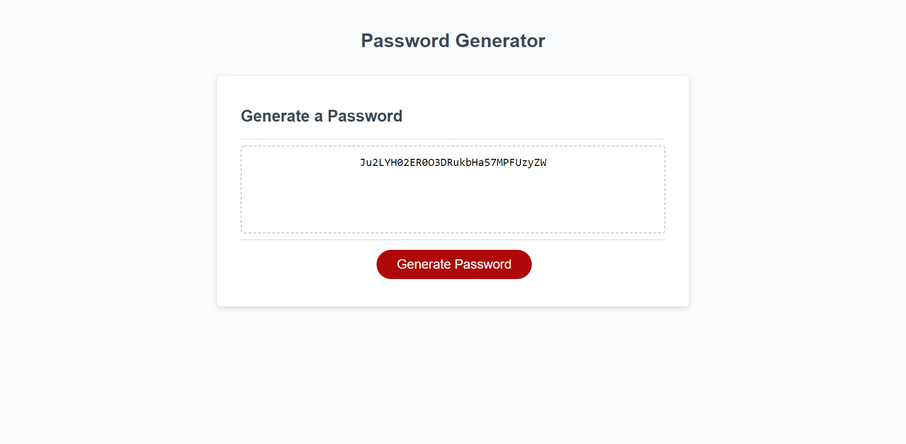

# password-generator-js

Used JavaScript to generate a random, secure password for the user.

## Description

Create a new , secure password

## Link to live application

You can view the GitHub page deployed application [here](https://sumaiasorna.github.io/password-generator-js/)

## Technical steps

- Stored arrays of characters (uppercase,lowercase,number and special characters)
- function used to determine the length of the password
- function used to determine whether the user wants to include uppercase characters in the password
- function used to determine whether the user wants to include lowercase characters in the password
- Function used to determine whether the user wants to include numbers in the password
- Function used to determine whether the user wants to include special characters in the password
- declare password array to store the random characters and push to choice array

## screenshots

